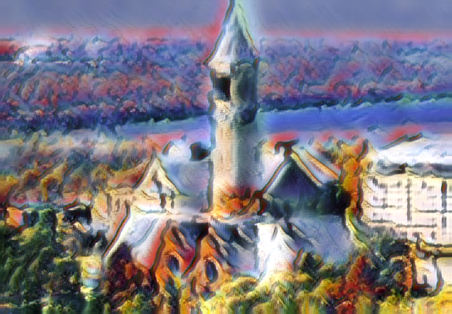
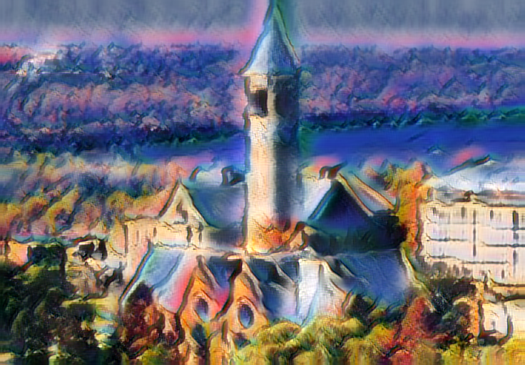
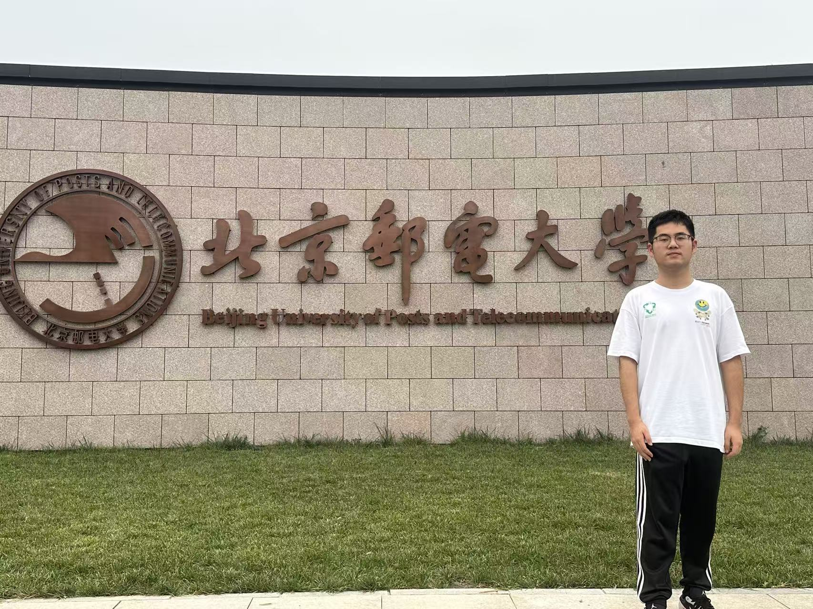
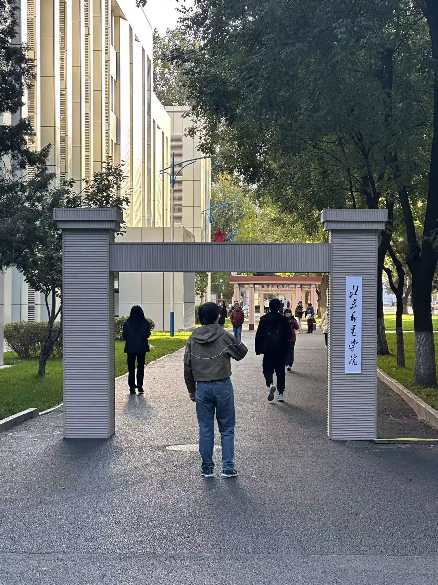
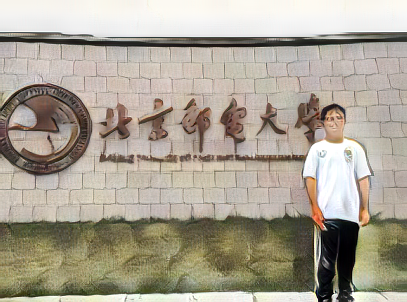
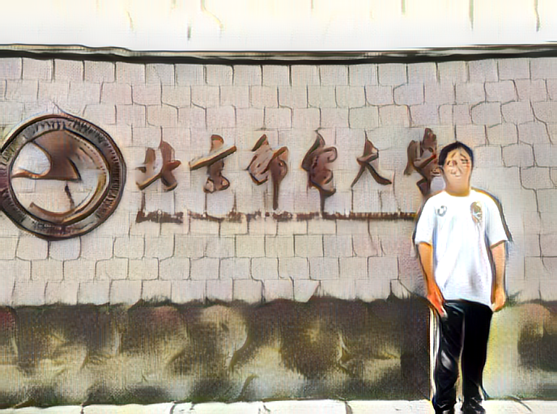

# 实验三：图像风格迁移 

## 1. 实验概述

本次实验基于 pytorch-AdaIN 项目，成功完成了模型训练与自定义风格迁移任务。

### 任务 (1) & (2): 模型训练与过程可视化

**训练设置：**
- **迭代次数 (Iterations)**: 10,000 次
- **数据集**: MS-COCO (内容图) + WikiArt (风格图)
- **可视化工具**: TensorBoard

#### 1.1 损失函数曲线 (TensorBoard)
以下为 TensorBoard 记录的训练 Loss 变化曲线：
![[976184294cce024872cd8550a7a7fcfe.png]]
![[d1796381f5e6867fec4c49e1a753a4da.png]]

#### 1.2 训练过程中的风格迁移效果
我们截取了训练过程中不同阶段模型对同一组 Content/Style 图片的迁移效果，观察模型如何逐步学习到风格特征。

*   **Content**: `cornell.jpg`
*   **Style**: `woman_with_hat_matisse.jpg`

| 训练进度 | 迭代次数 | 效果展示                            |
| :------: | :------: | :---------------------------------- |
| **10%**  |  1,000   |    |
| **50%**  |  5,000   |    |
| **80%**  |  8,000   |    |
| **100%** |  10,000  |  |

---

### 任务 (3): BUPT 景点打卡风格迁移

*   **风格说明**: 选取了 **梵高 (Van Gogh)** 的《星月夜》作为风格源。

|         原始照片 (Content)          |    风格参考 (Style)     |            风格迁移结果 (Result)            |
| :---------------------------------: | :---------------------: | :-----------------------------------------: |
| **图 1**  |   | **结果 1**  |
| **图 2**  |         (同上)          | **结果 2**  |

---

### 任务 (4): Alpha Blending (风格融合)

**要求**：使用与任务(3) **不同** 的风格，进行 Alpha Blending。Alpha 值控制风格化的程度 ($I_{output} = (1-\alpha)I_{content} + \alpha I_{style\_feature}$)。

*   **风格说明**: 选取了 **毕加索 (Picasso)** 的立体主义作品作为风格源。
*   **Alpha 值序列**: 0.3, 0.6, 0.9 

**对比展示：**

|        原始照片        |        风格参考        |
| :--------------------: | :--------------------: |
|  |  |

**不同 Alpha 值的融合效果：**

|         Alpha = 0.3 (微弱风格)         |           Alpha = 0.6 (平衡)           |         Alpha = 0.9 (强烈风格)         |
| :------------------------------------: | :------------------------------------: | :------------------------------------: |
|  |  |  |

从左至右可以看到：随着 Alpha 值增大，原图的人物轮廓逐渐被毕加索的几何色块所解构和重组，画面的抽象程度显著提升。

---

## 2. 实验总结

1.  **训练收敛性**：
    从 TensorBoard 曲线（图 1.1）可以看出，在 10,000 次迭代内，Network 的 Content Loss 和 Style Loss 均呈显著下降趋势。从 1.2 节的过程图中直观可见，模型在 1000 iter 时仅能迁移大致色调，而在 10000 iter 时已能清晰地复现马蒂斯画作的复杂纹理，说明模型训练有效。

2.  **风格迁移的泛化能力**：
    在任务 3 中，我们使用了训练集中未出现的 BUPT 校园生活照和梵高/毕加索画作。结果表明，AdaIN 模型具有极强的**任意风格迁移 (Arbitrary Style Transfer)** 能力，无需重新训练即可将从未见过的艺术风格应用到任意照片上。

3.  **Alpha Blending 的平滑控制**：
    任务 4 验证了 AdaIN 解码器特征空间的线性特性。通过在特征层线性插值（Alpha Blending），我们可以平滑地控制由“写实”到“抽象”的过渡，这在艺术创作和滤镜设计中具有很高的实用价值。
